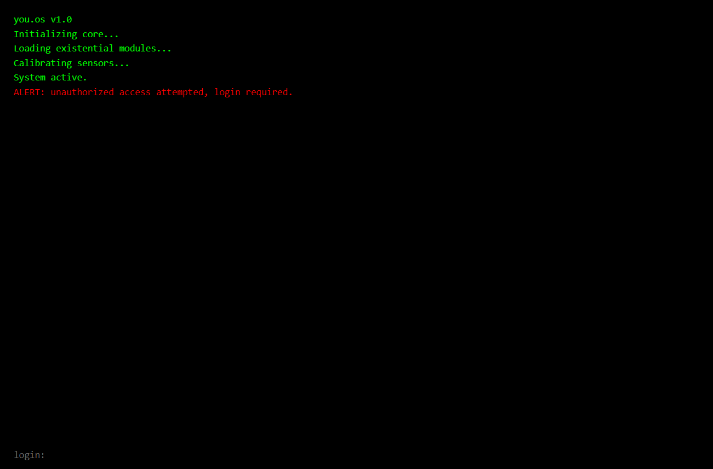

# you.os

A terminal-style web application that interprets emotional inputs as system commands, powered by the Groq API with a dark, existential aesthetic.

[Live Demo](https://void-7zy3.onrender.com)

## 🚀 Features

- 🖥️ Terminal-style interface with boot and login sequence
- 🤖 AI-powered responses via Groq API (Llama 3.1 model)
- 😔 Emotional input processing with poetic, technical responses
- 📜 Session logging with export functionality
- ✨ Glitchy typing animations and responsive design
- 🔧 Customizable username and hostname
- 🤫 Silence mode for occasional non-responses

## 📸 Screenshots

 (Placeholder for actual screenshot)

## 🧩 Tech Stack

- **Frontend**: HTML5, CSS3, Vanilla JavaScript
- **Backend**: Node.js, Express
- **AI**: Groq API (Llama 3.1 model)
- **Dependencies**: cors, dotenv, express, node-fetch, compression, winston
- **Dev Tools**: ESLint, Jest, Nodemon
- **Environment**: Configuration via `.env` file
- **Deployment**: Static server compatible (e.g., Vercel, Netlify) or Node.js server

## 🛠️ Getting Started

### Prerequisites
- Node.js (v16 or higher)
- A Groq API key from [Groq Console](https://console.groq.com)

### Installation

1. Clone the repository:
   ```bash
   git clone https://github.com/yourusername/void.git
   cd void
   ```

2. Install dependencies:
   ```bash
   npm install
   ```

3. Create a `.env` file in the root directory and add your Groq API key:
   ```env
   GROQ_API_KEY=your_groq_api_key
   ```

4. Start the development server:
   ```bash
   npm run dev
   ```

5. Visit `http://localhost:3000` in your browser.

Alternatively, for static hosting:
- Serve the `public` directory using a static server (e.g., `npx live-server public`).
- Ensure the backend server is running separately for API requests.

## 📖 Usage

1. The application starts with a boot sequence, followed by a login prompt.
2. Enter a username.
3. Type emotional inputs (e.g., "terminate yourself") or system commands (e.g., `system.help`).

### Example Interactions
```bash
user@void> exit
system: you are still here.

user@void> system help
system: help is not a recognized command.
```

### Available Commands
- `system.help` - Show available commands
- `log.show` - Display session log
- `log.hide` - Hide session log
- `log.export` - Download session log
- `log.clear` - Clear session log
- `silence.enable` - Enable silence mode
- `silence.disable` - Disable silence mode
- `history.clear` - Clear conversation history
- `user.set "name"` - Set username
- `host.set "name"` - Set hostname

## 🧠 What I Learned

- Building a terminal-style UI with HTML, CSS, and JavaScript
- Integrating Groq API for AI-driven responses
- Managing environment variables with a custom EnvLoader class
- Implementing glitchy typing animations and session logging
- Handling asynchronous API calls with error fallbacks
- Creating a responsive, mobile-friendly design
- Setting up a Node.js/Express backend with logging and compression

## 📫 About Me

- [LinkedIn](https://www.linkedin.com/in/yourprofile) (Add your LinkedIn profile)
- [GitHub](https://github.com/yourusername) (Add your GitHub profile)

## 📚 References

- [Groq API Documentation](https://console.groq.com/docs)
- [Express.js Documentation](https://expressjs.com)
- [JavaScript Fetch API](https://developer.mozilla.org/en-US/docs/Web/API/Fetch_API)